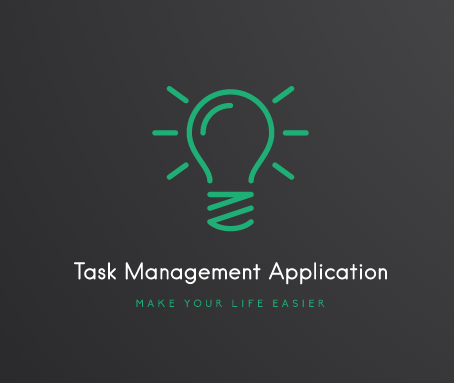
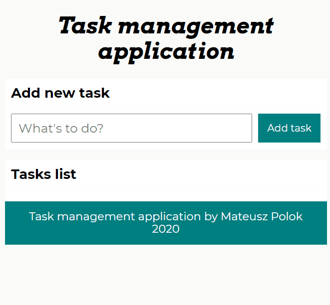
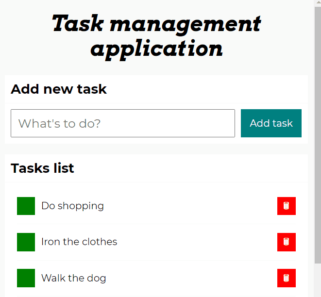
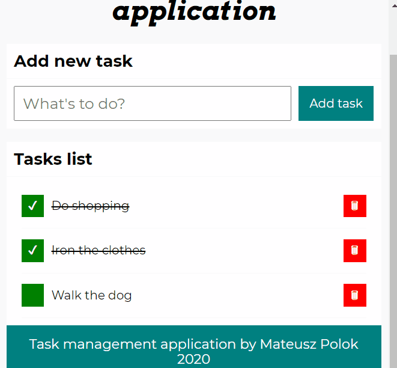

# Task Management Application
This is a task management application that allows you manage your daily tasks and activities. You can add task to list, then when you done this activities you can mark this as a done and finally you can remove task from list. This application for sure make your life easier.

# Live Demo
https://mateusz24polok.github.io/task-management-application/

# Instructions how to use
1. Add tasks to list

2. When you are ready mark task as a done

3. Finally you can clean done tasks

# Technologies used in project:
- Semantic HTML
- CSS with Flexbox
- JavaScript (ES6+)
- GoogleFonts

# Author and contact
- author: Mateusz Polok
- email: mateusz24polok@gmail.com
- phone: +48535731868